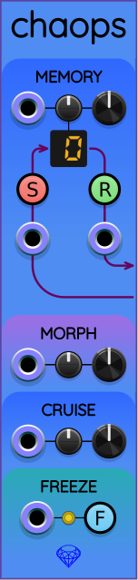

## Chaops

The name "Chaops" is an abbreviation of "chaos operators". Chaops is a left-expander module that provides extra functionality to the chaos modules [Frolic](Frolic.md), [Glee](Glee.md), [Lark](Lark.md), and [Zoo](Zoo.md). Placing Chaops to the immediate left of one of these chaos modules allows you to access additional functionality.

### Demo video

### Memory

The section labeled MEMORY allows you to select one of 16 memory cells with addresses numbered 0..15. You can then store/recall the state of the chaos module to the right at any time. This allows you to create repetitive chaotic control signals, or to restart a known state for reproducible results.

Immediately below the MEMORY label, from left to right, are a CV input port, a smaller attenuverter knob, and a larger manual selector knob. Turning the selector knob changes the active memory cell address, as reflected in the LED display.

You can automate selecting a memory cell by connecting an input cable to the memory CV input port and setting the attenuverter to a nonzero value. If you turn the attenuverter knob all the way clockwise to 100%, then each half volt (0.5&nbsp;V) increment of input voltage will increase the memory address by 1. Memory addresses are not clamped; instead, they wrap around. So by trying to go beyond address 15, you wrap back around to 0. Likewise, going below 0 will wrap around to 15.

Below the memory cell LED display are two buttons. The one on the left is labeled S, and the one on the right is labeled R. The S button stands for "store", and when pressed, causes the current state of the chaos module to be stored inside the selected memory cell.

When you press the R button, which stands for "recall", the state of the chaos module is restored to the saved state from the selected memory cell.

Beneath the R and S buttons are corresponding trigger inputs that allow you to automate storing and recalling chaos states.

### Morph

The chaos modules all produce 3D vectors. Without Chaops, these 3D vectors are always position vectors in an abstract 3D space. The MORPH section in Chaops allows you to select position vectors, velocity vectors, or any linear combination between the two. By default, the larger knob on the right is set to 0, which keeps the existing position vector output behavior. When you turn the knob all the way clockwise to 1, the chaos module to the right of Chaops will output velocity vectors instead. Intermediate values between 0 and 1 output a linear weighted mix of position and velocity. The CV input port and attenuverter allow you to automate the morph mix between position and velocity. This feature provides another dimension of variability to produce novel chaotic signals.

### Cruise

(NOTE: This is a newer control that was added after the above demo video was recorded.)

Just like many vehicles have *cruise control* to maintain a steady speed, the CRUISE control group in Chaops helps regulate the speed of the attached chaos module's imaginary particle. If you use [Tricorder](Tricorder.md) on the right of the chaos module to watch the movement of the chaotic particle in 3D space, you will notice that sometimes the particle moves faster, sometime slower. The speed variability can be quite large in some of the attractor formulas (Lark, for example).

The CRUISE knob varies from 0 to 1. When it is set to 0 (its default value), the chaotic particle moves at its usual variable speed. This is the same behavior as when Chaops is not attached to the left side of the chaos module.

When CRUISE is set to 1, the particle's speed is held constant in theory, nearly constant in practice. The reason for imperfectly uniform speed is that many of the attractor formulas have been made more "voltage-friendly" by compressing or stretching distances independently in the x, y, and z directions. We view the particle's movement after its position has been transformed differently along different directions in space. Although not perfectly uniform, you may find the effect useful in regulating rhythms or timing created by the chaos module.

When CRUISE is set to values between 0 and 1, the particle's speed is interpolated linearly between the original unprocessed speed it would have with CRUISE=0 and the uniform speed it would have when CRUISE=1. Therefore, by adjusting CRUISE gradually from 0 to 1, the particle's speed will become gradually more steady.

Interesting use case: If you adjust **both** CRUISE=1 and MORPH=1 (see previous section), you will end up graphing the velocity vectors instead of position vectors, and all the velocity vectors will have the same magnitude. If it weren't for the aforementioned "voltage-friendly" transformations, the particle would always be confined to the surface of a sphere. In practice, the transformations will cause some attractors to render on an oblong or oblate spheroid.

Every attractor formula has its own *cruising speed*. This is the speed the particle moves when CRUISE=1. The crusing speeds have been customized for all attractor formulas used by Sapphire. I made an effort to match the cruising speed of each attractor to its rough average speed.

### Freeze

At the bottom of the panel is a section labeled FREEZE. To the right is a button labeled F. When you press the F button, it toggles whether the chaos module to the right updates the simulation with time or not.

To the left is an input port. Between the input port and the F button, there is a tiny button that toggles whether the input port is treated as a gate signal or a trigger signal. When the button is yellow, the input is treated as a gate. When the button is dark, the input is treated as a trigger.

The default is to treat the input port as a gate. The button and gate input operate in combination with exclusive-or (XOR) logic. This means that if the freeze button is turned off, then the input gate must go high to freeze the module, or low to let it run. If the freeze button is turned on, then the input gate must go low to freeze the module, or high to let it run.

But when in trigger mode, a trigger received on the input port toggles the current freeze state. In this configuration, the voltage trigger and the manual button both act as mutual toggles with XOR logic.

Note that the FREEZE control does not hinder the MORPH control. Changes to the morph mix still take effect even when the chaos module is frozen. This is because FREEZE only stops the flow of simulated time, but does not block the mix ratio between position and velocity.
